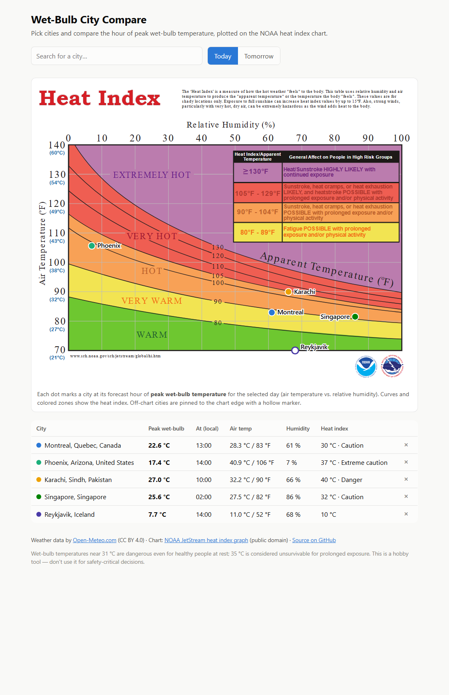

# Wet-Bulb City Compare

Compare how dangerously hot it is between cities, at a glance.

Pick cities and each one is plotted as a dot on the classic [NOAA JetStream heat index chart](https://www.weather.gov/jetstream/hi) at its forecast hour of **peak wet-bulb temperature** for the day (air temperature vs. relative humidity). A table below the chart lists each city's peak wet-bulb temperature, when it occurs, and the corresponding heat index.



**Live site:** https://etienne-lefebvre.github.io/wet-bulb-city-compare/

## Why wet-bulb?

The heat index tells you how hot it *feels*; the wet-bulb temperature tells you whether your body's cooling system still *works*. Wet-bulb is the lowest temperature evaporation (i.e. sweating) can cool you to — around **31 °C** it becomes dangerous even for healthy people at rest, and **35 °C** is considered unsurvivable for prolonged exposure. Peak wet-bulb often does not happen at the hottest hour of the day (humidity is usually higher earlier), so this tool scans the hourly forecast and picks the true peak.

## Features

- Search any city worldwide (Open-Meteo geocoding), up to 8 at once
- Dot plotted at the peak wet-bulb hour of **today or tomorrow** (city-local time)
- Table with peak wet-bulb, time, air temperature, humidity, heat index and its danger category
- Celsius labels added to the chart's Fahrenheit temperature axis
- Cities remembered in your browser (localStorage) — no accounts, no tracking
- Cities cooler than the chart's 70 °F range are pinned to the chart edge as hollow dots

## Running it

It is a fully static site — no build step, no API keys, nothing to install.

```sh
# any static file server works, e.g.:
python -m http.server
# then open http://localhost:8000
```

(Opening `index.html` directly from disk won't work because the chart SVG is fetched at runtime.)

## How it works

- **Weather data:** [Open-Meteo](https://open-meteo.com/) forecast API (free for non-commercial use, no key). Hourly `temperature_2m`, `relative_humidity_2m` and `wet_bulb_temperature_2m`; if the wet-bulb field is ever missing it falls back to the Stull (2011) approximation.
- **Heat index:** NWS Rothfusz regression with the official low-humidity and high-humidity adjustments.
- **Chart:** the NOAA JetStream heat index graph (public domain, US government work). `Heat_Index_graph.svg` is the untouched original; `graph.svg` adds Celsius axis labels and a `viewBox`. Dot positions are calibrated against the chart's own gridlines (see constants at the top of `app.js`).

## Credits & license

- Code: [MIT](LICENSE)
- Chart: NOAA/NWS JetStream, public domain
- Weather data: [Open-Meteo.com](https://open-meteo.com/), [CC BY 4.0](https://creativecommons.org/licenses/by/4.0/)

Not for safety-critical decisions — it's a hobby comparison tool built on forecast data.
